# Diabetes_Prediction

WebApp

• If you want to view the deployed model App, click here "https://diabetes--predictor--app.herokuapp.com/"

Web App gif

• If you are searching for Code, Algorithms used and Accuracy of the model Please check the code section of a repository and open the Logistic_Regression.jpynb file.

• If this repository helped you please give a ⭐ to the repository

# Introduction:

In this project, the objective is to predict whether the person has Diabetes Or not based on various features like Glucose level, Insulin, Age, and BMI. 

(Pima Indians dataset) Dataset is downloaded from the Kaggle. Here I am used a Logistic Regression Algorithm. It’s a Supervised Machine Learning Algorithm.

## The following features have been provided to help us predict whether a person is diabetic or not:

-	Pregnancies: Number of times pregnant

-	Glucose: Plasma glucose concentration over 2 hours in an oral glucose tolerance test

-	Blood Pressure: Diastolic blood pressure (mm Hg)

-	Skin Thickness: Triceps skin fold thickness (mm)
	
-	Insulin: 2-Hour serum insulin (mu U/ml)

-	BMI: Body mass index (weight in kg/(height in m)2)

-	Diabetes Pedigree Function: Diabetes pedigree function (a function which scores likelihood of diabetes based on family history)

-	Age: Age (years)

-	Outcome: Class variable (0 if non-diabetic, 1 if diabetic)

## Step 1: Data gathering & Importing Libraries

-	All the standard libraries like numpy, pandas, matplotlib and seaborn are imported in this step. We use numpy for linear algebra operations, pandas for using data frames, matplotlib and seaborn for plotting graphs. The dataset is imported using the pandas command read_csv ().

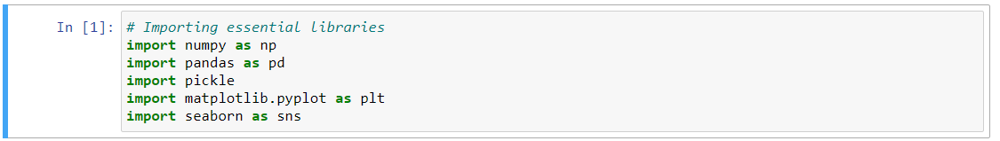

## Step 2: Process the data for analysis

-	Check the missing values

-	Check Corrupted values, such as invalid entries

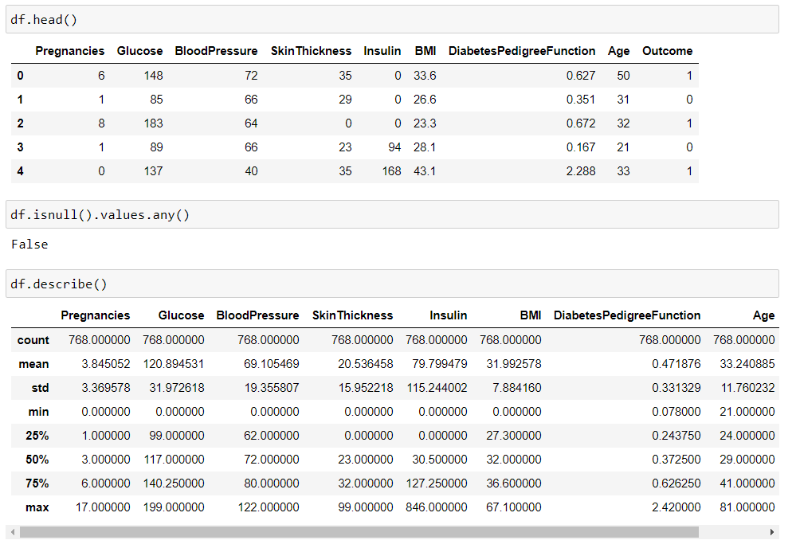

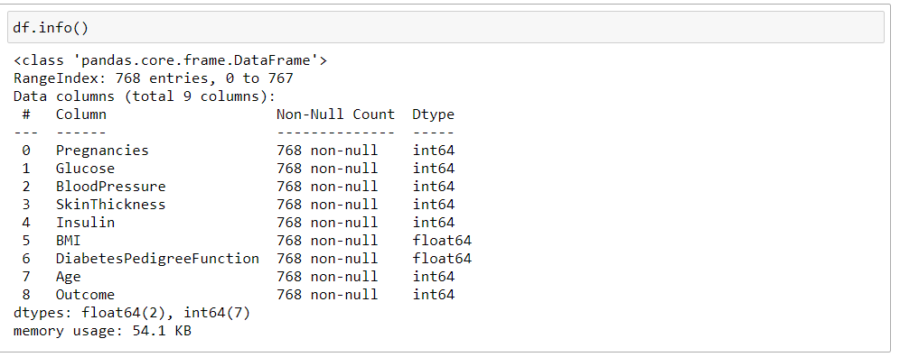

1. There are a total of 768 records and 9 features in the dataset.
 
2. Each feature can be either of integer or float data type.
 
3. Some features like Glucose, Blood pressure, Insulin, BMI have zero values which represent missing data.

4. There are zero NaN values in the dataset.

5. In the outcome column, 1 represents diabetes positive and 0 represents diabetes negative

## Step 3: Data Visualizations

Data visualization is the graphical representation of information and data. By using visual elements like charts, graphs, and maps, data visualization tools provide an accessible way to see and understand trends, outliers, and patterns in data.

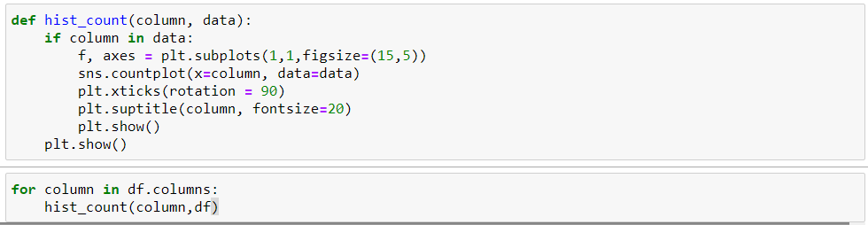

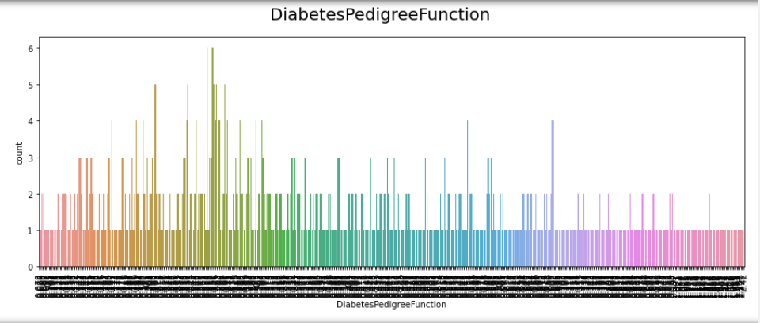

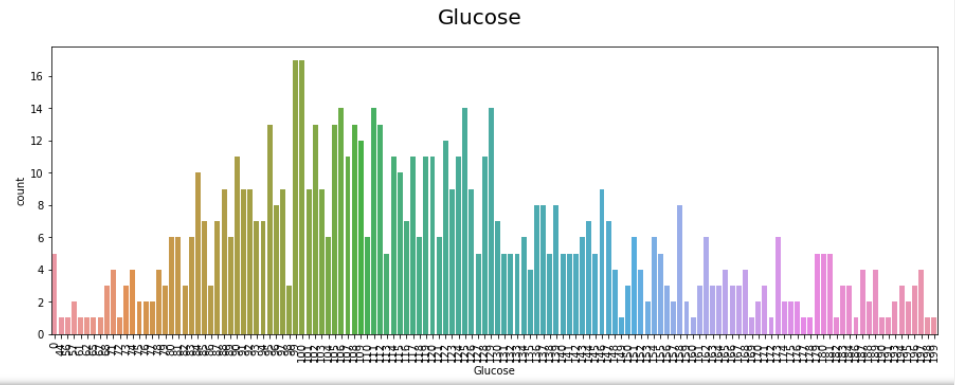

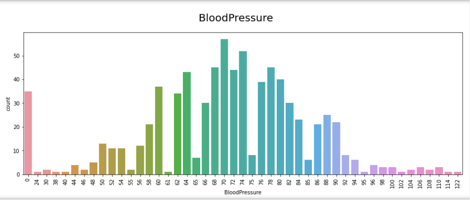

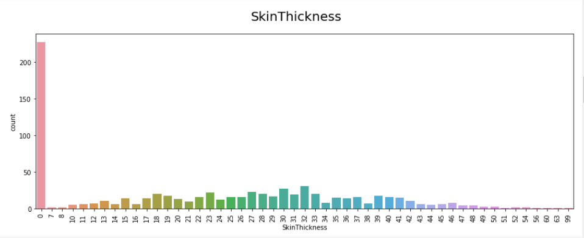

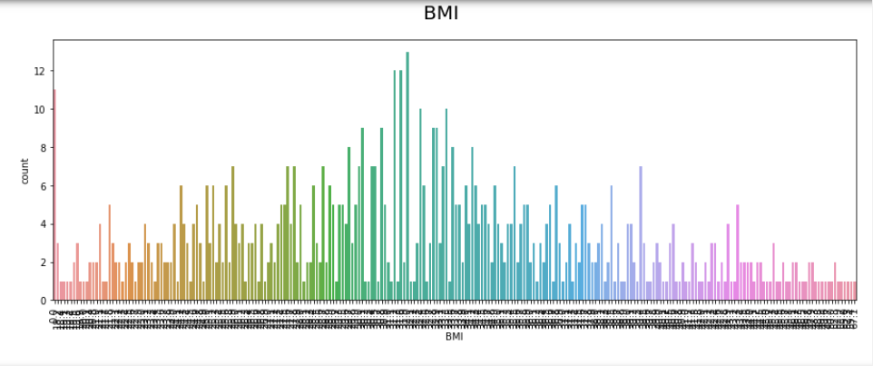

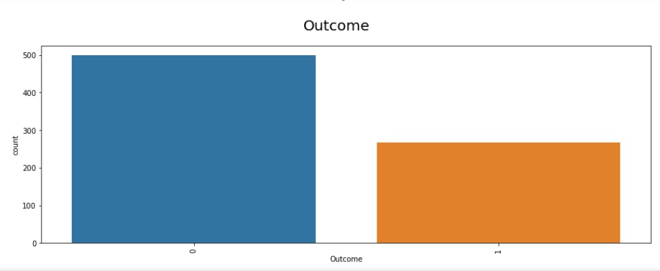

## Pairplot

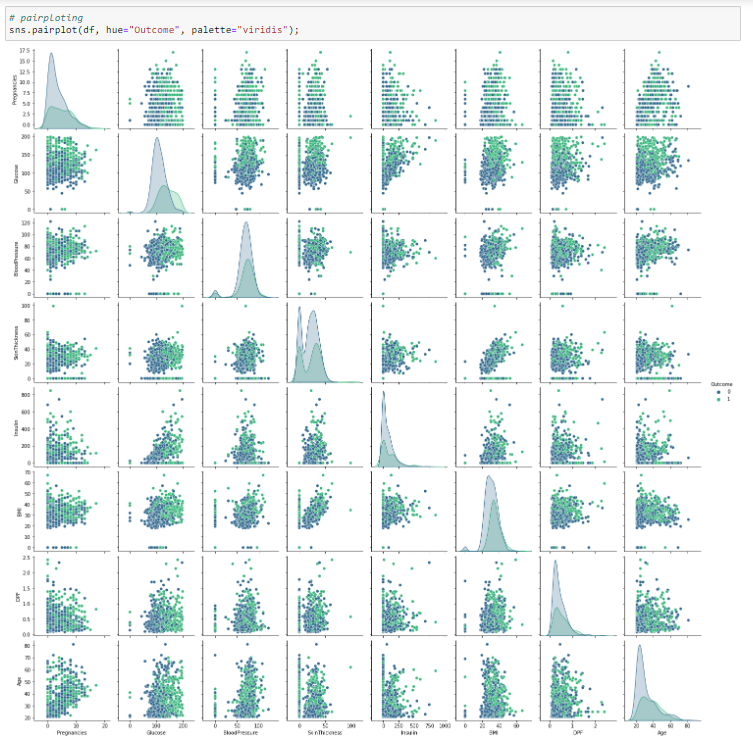

## Check the correlation between feature

## Correlation heatmap

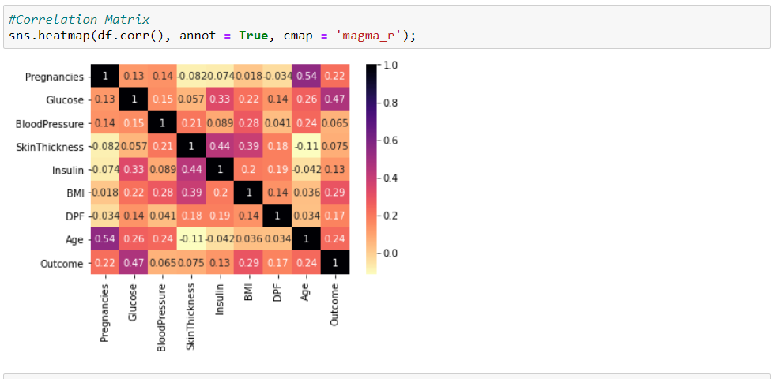

## Step 4: Data Preprocessing

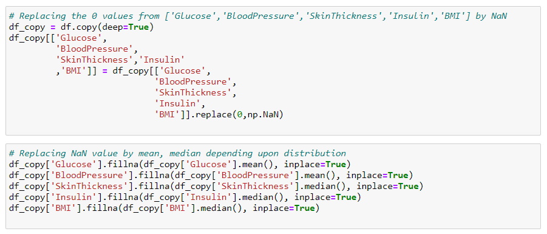

In this dataset, the missing values are represented by zero values that need to be replaced. The zero values are replaced by NaN so that missing values can easily be imputed using the fillna() command.

## Step 5: Data Modelling & Model Evolution

## Logistic Regression

•	Logistic regression is a supervised learning classification algorithm used to predict the probability of a target variable. The nature of target or dependent variable is dichotomous, which means there would be only two possible classes.

•	In simple words, the dependent variable is binary in nature having data coded as either 1 (stands for success/yes) or 0 (stands for failure/no).
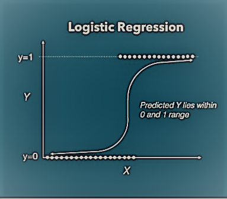

## Step 6: Create & dump the pickle file:

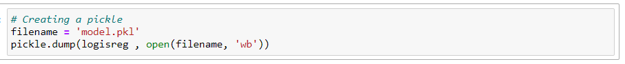

## Step 7: Building Web Application 

Now that our machine learning pipeline and model are ready we will start building a web application that can connect to them and generate predictions on new data in real-time. There are two parts of this application:

•	Front-end (designed using HTML & CSS )

•	Back-end (developed using Flask in Python 3.9)

---hs
command for install flask
pip install Flask
---

## Front-end of Web Application  

•	Index.html

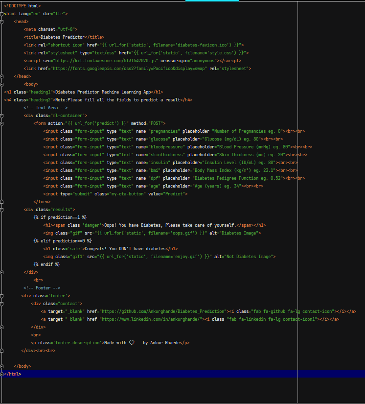

•	Style.css 

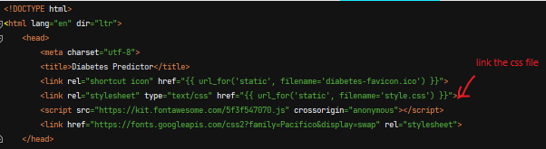

## Back-end of Web Application 

The back-end of a web application is developed using a Flask framework. 

Testing App

One final step before publish the application on Heroku is to test the web app locally. Open terminal navigate to folder where ‘app.py’ is saved on. Run the python file with below code:

---hs
python app.py
---

Output in terminal when app.py is executed

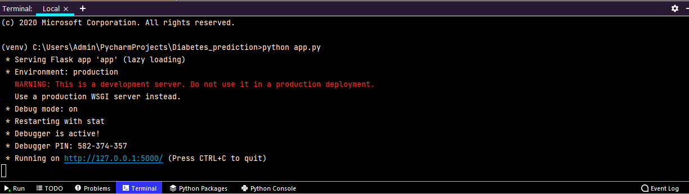

copy the URL into a browser and it should open a web application hosted on local machine (127.0.0.1).

Web application opened on local machine

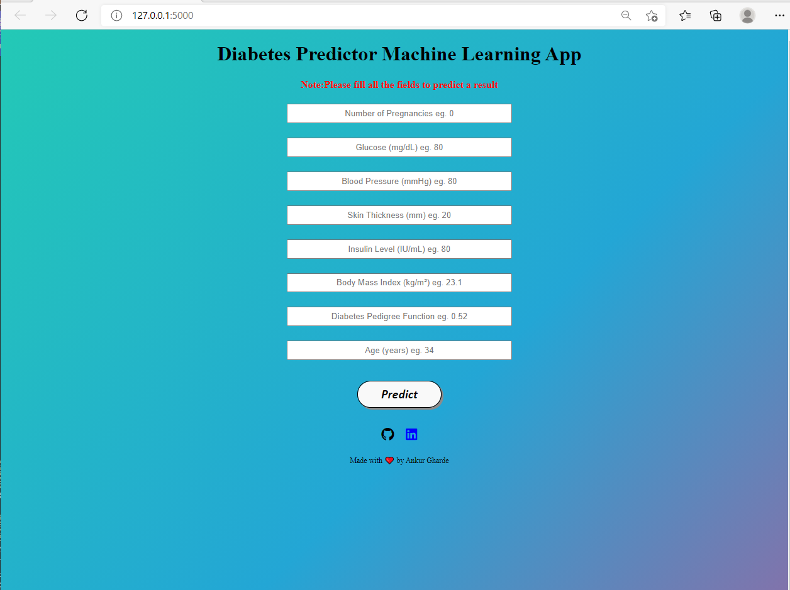

## Step 8 : Deploy the Web App on Heroku 

•	Now that the model is trained, the machine learning pipeline is ready, and the application is tested on local machine, Ml model is ready for deployment.  
•	For model deployment process, two more files are necessary, Reqirement.txt & Procfile

- Requirment.txt: requirements.txt file is a text file containing the names of the python packages required to execute the application. If these packages are not installed in the environment application is running, it will fail.

- pip freeze > requirements.txt (this command is used to create the requirement.txt file)

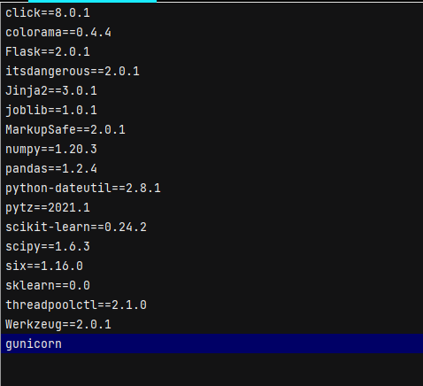

- Procfile: Procfile is simply one line of code that provides startup instructions to web server that indicate which file should be executed first when somebody logs into the application. 

- In this example the name of our application file is ‘app.py’ and the name of the application is also ‘app’. (hence app:app)

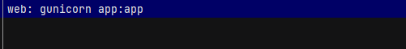  

##  Sign up on heroku.com and Log in

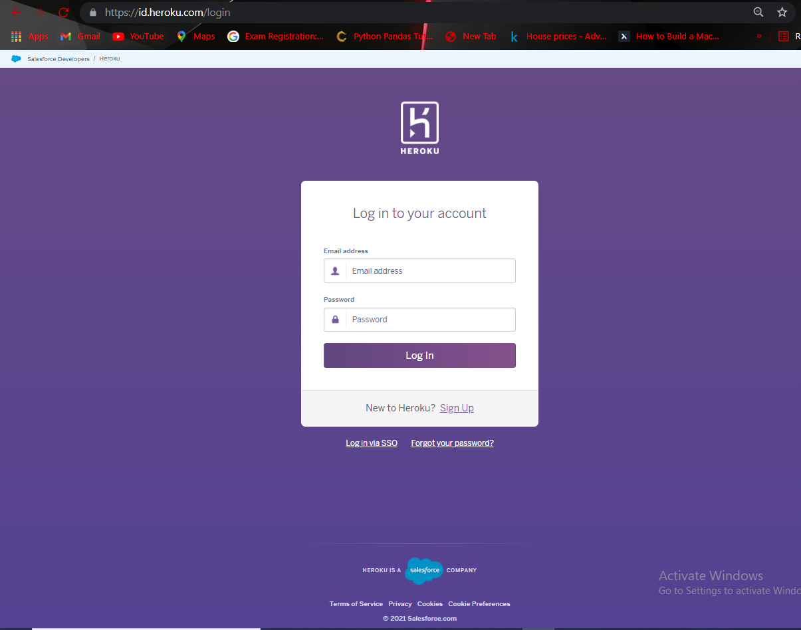

##  After log in click on the new button

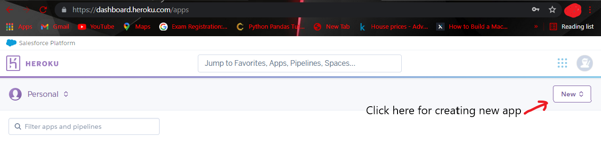

## Create new app

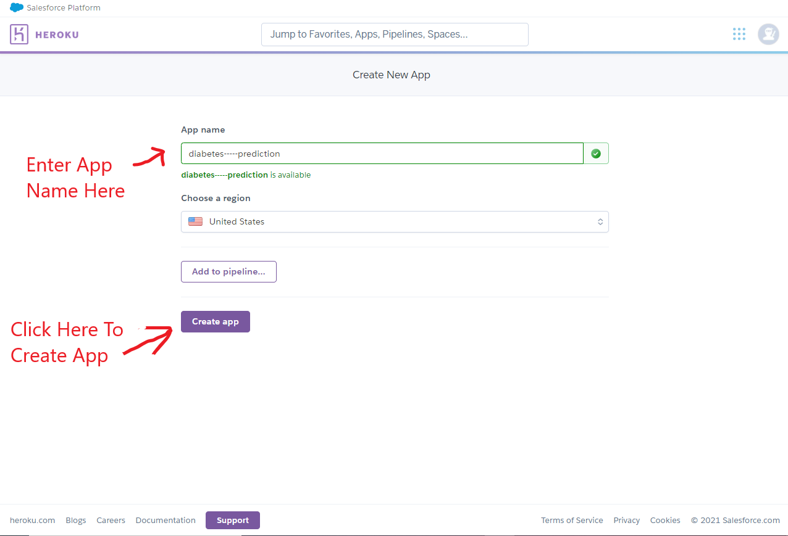

## Click on Deploy & Connect to your GitHub repository where code is hosted.

## Deploy branch

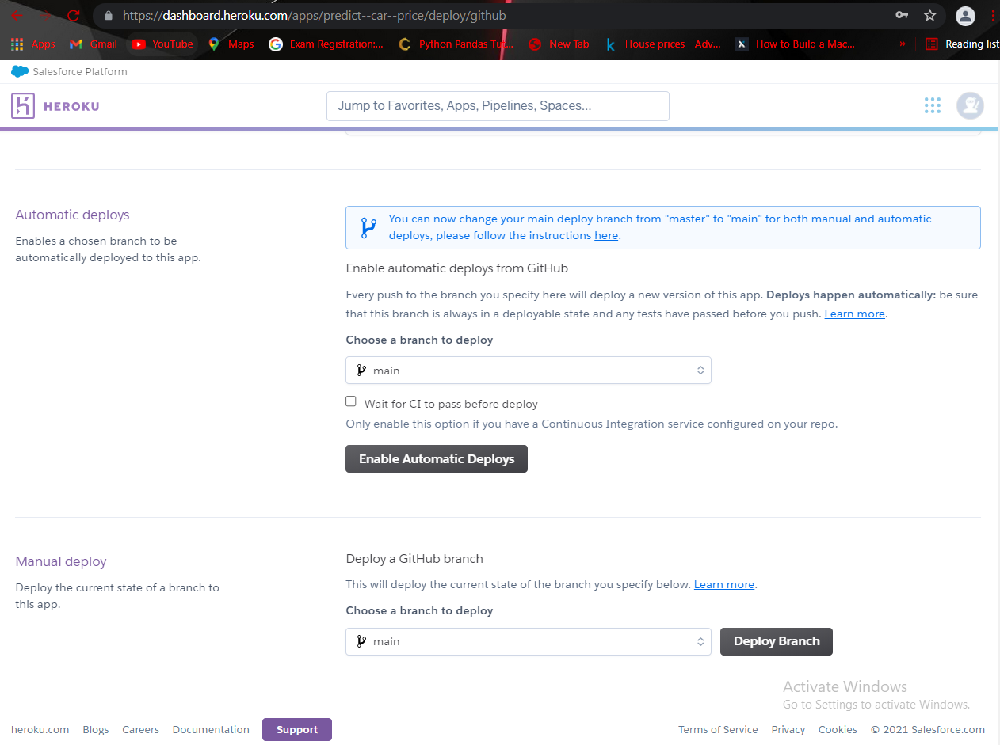

## Wait for Few Minutes, after that app is deployed successfully

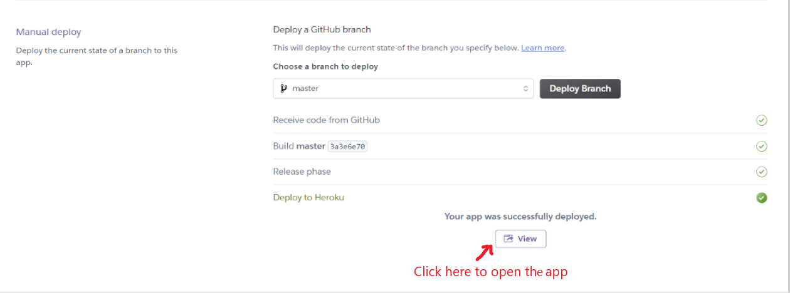

## App is successfully deployed on Heroku.

